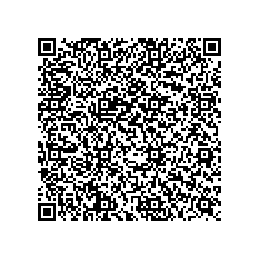

[](https://www.paypal.com/cgi-bin/webscr?cmd=_s-xclick&hosted_button_id=D66EM3DGU35EE&source=url)
[](/LICENSE)


<p align="center" >
  <a href="https://github.com/ismaeldamiao/libism" >
    
  </a>
</p>

# LibIsm

`LibIsm`
é uma bilbioteca escrita com a finalidade
de axiliar o desenvolvimento de programas destinados à
pesquisa em física computacional.

Atualmente a coleção conta com as seguintes bibliotecas:
TODO: Publicar alguma parte da biblioteca.

## Download

TODO: Explicar como descarregar a versão estável mais recente
da biblioteca.

## Doações

Todo os arquivos são publicados com licença de código aberto,
portanto considere fazer uma doação para dar suporte ao desenvolvedor
o físico [I.F.F. dos Santos](https://github.com/ismaeldamiao/).

Métodos de doação:

* PayPal: Use o link <https://www.paypal.com/cgi-bin/webscr?cmd=_s-xclick&hosted_button_id=D66EM3DGU35EE&source=url>.
* PIX: Use a chave PIX `ismaellxd@gmail.com` ou o código QR abaixo.  
  <p align="center" ></p>


## Licença

Todo o conteúdo do repositório está distribuído sob as condições da
[licença MIT](LICENSE).

```
MIT License

Copyright (c) 2024 I.F.F. dos Santos

Permission is hereby granted, free of charge, to any person obtaining a copy 
of this software and associated documentation files (the “Software”), to 
deal in the Software without restriction, including without limitation the 
rights to use, copy, modify, merge, publish, distribute, sublicense, and/or 
sell copies of the Software, and to permit persons to whom the Software is 
furnished to do so, subject to the following conditions:

The above copyright notice and this permission notice shall be included in 
all copies or substantial portions of the Software.

THE SOFTWARE IS PROVIDED “AS IS”, WITHOUT WARRANTY OF ANY KIND, EXPRESS OR 
IMPLIED, INCLUDING BUT NOT LIMITED TO THE WARRANTIES OF MERCHANTABILITY, 
FITNESS FOR A PARTICULAR PURPOSE AND NONINFRINGEMENT. IN NO EVENT SHALL THE 
AUTHORS OR COPYRIGHT HOLDERS BE LIABLE FOR ANY CLAIM, DAMAGES OR OTHER 
LIABILITY, WHETHER IN AN ACTION OF CONTRACT, TORT OR OTHERWISE, ARISING 
FROM, OUT OF OR IN CONNECTION WITH THE SOFTWARE OR THE USE OR OTHER DEALINGS 
IN THE SOFTWARE.
```
